# SWE645 Extra Credit - Docker setup, EC2 Instance Setup and Kubernetes Cluster Deployment using Rancher with Jenkins CI/CD Pipeline

This repository contains part of the **backend** of the **SWE645 Extra Credit** assignment, which includes Dockerfile, Jenkinsfile, YAML files, config files, and images.

YAML Files included for:
- Cluster
- Deployment
- Node Port Service
- KubeConfig

These YAML Files were not modified manually, they were **auto generated** by following the steps below. YAML Files for the 3 Pods are not included because they could change if a Pod goes down. Machines from HW2 were reused, so most of this will be repeat for HW2.

### **Almost all of this is exactly the same as HW3. Specfic parts, like pictures and python specific commands, will of course be updated.**

---

## Prerequisites

Before beginning this part, please complete part 1 from Kris' branch in this repository. Also have with you:

- **DockerHub Account**: To create Docker image
- **AWS Account**: To create EC 2 instances to run your cluster.
- **Part 1 project files**

Make sure the following tools are installed:
- **Git**: Version control
- **Maven**: To build the application jar file
- **Docker**: To containerize and run the application
- **Java**: To run the webserver and for Jenkins

## Setup Instructions
### Docker Image
### 1. Clone the repository:
To get started, clone this repository to your local machine:
```
git clone https://github.com/krisnguyenn2020/SWE645-Extra-Credit.git
cd SWE645-Extra-Credit
```

### 2. Build, run, and push Docker image

Unlike HW 3, there is no need to build a jar file since this application is python based, so we can just build the docker image like so:
```shell
    $ docker build -t ranaalshehri/swe645-extracredit-app-amd64:latest .
```

You should see the new image pop up on docker desktop.

To test the application locally, you can run the image in a container like so:
```shell
    $ docker run -d -p 8000:8000 ranaalshehri/swe645-extracredit-app-amd64:latest
```

Once up and running, you can test the functionality just like in Kris' branch (Part 1) in a web browser or using Postman.

Push your image to DockerHub like so:
```shell
    $ docker login
```
Following prompts to sign in, then:
```shell
    $ docker push ranaalshehri/swe645-extracredit-app-amd64:latest
```

If all the test run successfully, you can now setup your EC2 instances and Kubernetes Cluster like in HW2

### **Steps below were reused from HW2, please make sure to use the correct image tag you created or the one we used above** 

### EC2 Instances and Kubernetes Cluster Deployment
### 4. Log into you AWS Account:
Here you have two choices:

- [Personal AWS Acount login](https://aws.amazon.com/console/)
- [AWS Learner Lab login](https://awsacademy.instructure.com/login/canvas)

If your professor gave you an account for AWS Leaner Lab, you can use that to get some free money to used to create your machines(~$50). Otherwise, you will have to create/use your personal account which will charge you for items used in this part. 

**Note: Items created/used in this part will cost money. This is due to features used/needed for this to work correctly and due to stronger machines needed for Kubernetes Cluster support.**

For this assignment, we will be using AWS Learner Lab.


### 5. Create EC2 Instances:
For this part, we will be using two(2) EC2 instances. One will setup the cluster, while the other will run the actual cluster.

- Log into AWS Learner Lab

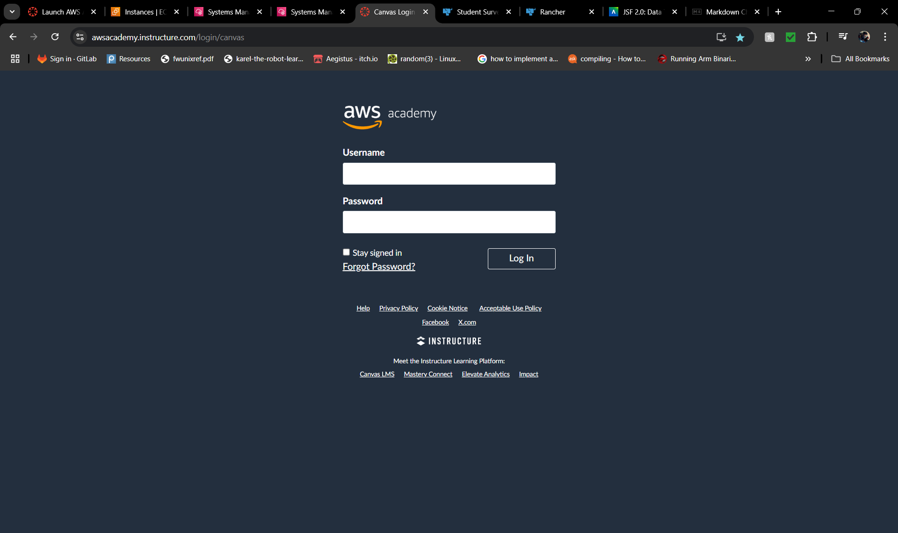


- Go to Modules -> Launch AWS Academy Learner Lab

- Click 'Start Lab' and wait a few minutes for it to load. The circle next to AWS will turn green when online. Click that link to go to the AWS Dashboard.


- On the homepage, search for EC2, click the first option

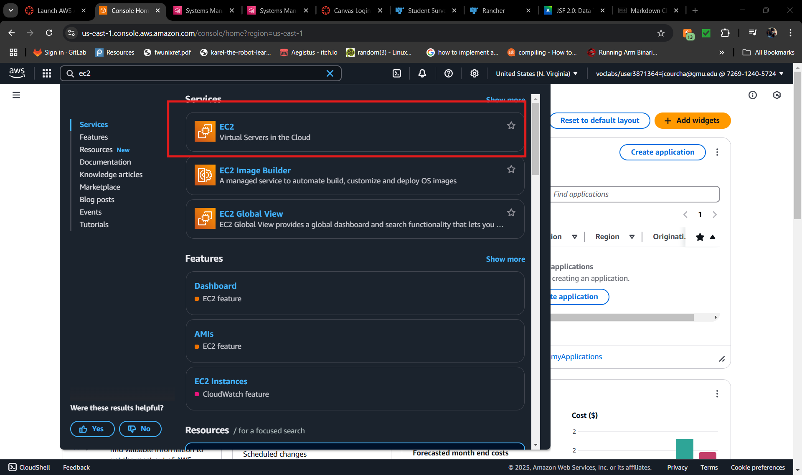


- On the EC2 page, click the orage button labeled 'Launch Instance'

- Here, you set up your two machines, we will create both at the same time. First, fill out a name for both machines. Next, on the right, change the number of instances to 2, that way both machines will have the same settings and key pair. Then, select 'Ubuntu' for OS option, default image is fine.


- Scroll down. Leave architecture as is. Change instance type to best that suits you. You will want at least 't2.medium' I recommend 't2.large' for more memory. Then select a key pair. You can create a new one or use an existing one. If creating a new one, click the link, and give it a name in the pop-up box. Leave everything else default. You with then download a private key file. 

- **DO NOT LOSE TRACK OF THIS .pem FILE. This is the only time you will get this file.**


- Next, setup Network Settings. Create a new security group and Allow SSH, HTTPS, and HTTP traffic inbound from anywhere(0.0.0.0/0). You will also need to add one more rule for port 8080. Click edit, scroll to 'Add security group rule.' Copy the settings as below:

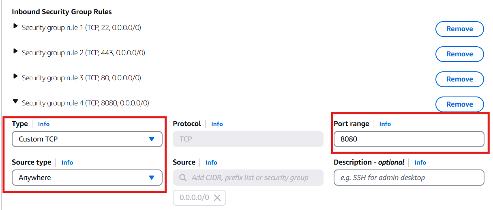

- Then, scroll to storage and set it to the size you need. You can get upto 30GB for free. Then, open 'Advanced details', for IAM instance profile, select 'LabInstanceProfile', then click 'Launch Instance' and wait for your machines to be ready.


### 6. Setup Rancher on one of the instances
Once your machines are online, we can connect to the both of them. Your machines are ready when the status check shows '2/2 checks passed' on the EC2 Dashboard.


**However, before we can connect to them, we need to setup elastic IP addresses for both machines. This step is crucial to ensure your cluster works again automatically if your machines auto-shutoff or you manually turn them off.**

 - On the EC2 Dashboard, select Elastic IP addresses:

 

 - On the Elastic IP page, click 'Allocate Elastic IP address', leave everything default and click 'Allocate' at the bottom.

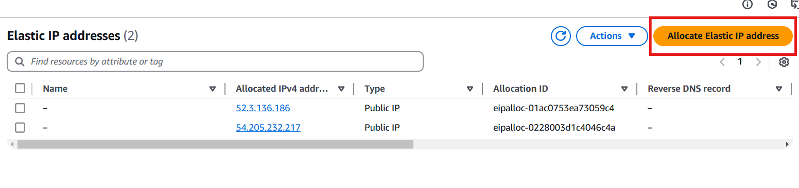

- With your new IP address, select it, then click Actions->Associate Elastic IP address.


- On this page, select instance, then the instance you want to associate it with, and click to allow reassociation. This is incase you have an issue and need to reassign this IP without creating a new one. Repeat this process for both machines, each with there **OWN** IP address.

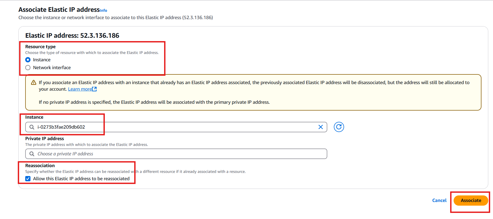

- Now you can connect to your machines. On the EC2 Dashboard, select instances. Then, one at a time, select an instance, click 'Connect'->Session Manager->Connect. If successful, a new tab will open connected to your machine.

- On both machines, run the following commands one after the other
``` shell
    $ sudo su
    $ sudo apt-get update
    $ sudo apt upgrade -y
    $ snap install kubectl --classic
    $ sudo apt install docker.io
```

- Now, on **ONE** of the machines we will setup Rancher. Go to [Rancher](https://www.rancher.com/quick-start) and copy the command listed there. Run this command on the one machine and wait for it to finish.

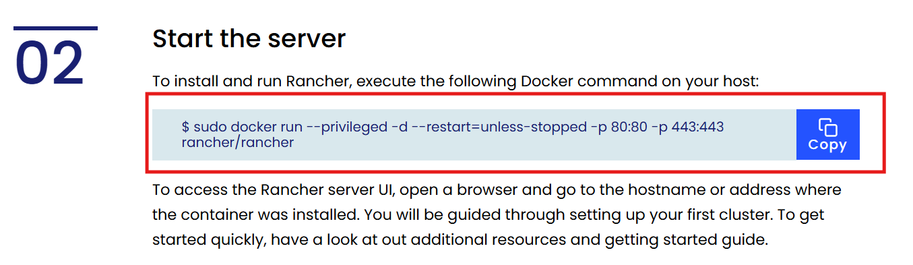

- When it is finished, run this command:
``` shell
    $ sudo docker ps
```
- This will give you the container-ID needed for setup


- Then, click on the public IPv4 DNS address to access the Rancher dashboard. 


- It will give you a privacy warning, but it is okay. Click 'Show advanced' and click the proceed link there. Follow the directions on screen to setup your account with this container. You will use the following command:
```shell
    $ docker logs container-id 2>&1 | grep "Bootstrap Password:"
```
- Make sure to replace "container-id" with your container's id

- Paste this password given into the Rancher dashboard. You can now setup the admin account. You can either randomly generate a password or create your own, save this password. Then make sure to accept terms and conditions and click continue. You login for future use will be the following:

    - Username: admin
    - Password: "Your password you set"

- Once logged in, you will see the dashboard and any existing clusters. We will create a new one to run on our **OTHER** EC2 instance. 


### 7. Create our cluter:

- Click on 'create' from the previous image

- In the next window, scroll and click on "Custom"

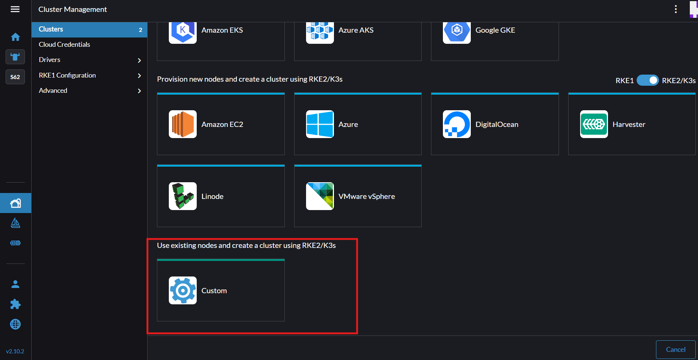

- Here, name your cluster, then click Create:

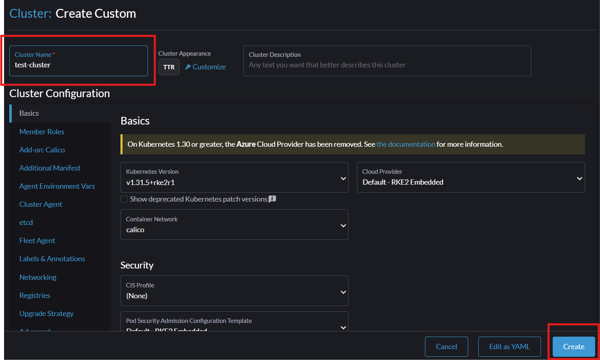

- Then, make sure etcd, Control Plane, and Worker are all checked. Then, click the insecure checkbox and copy the command given into your **SECOND** EC2 instance.

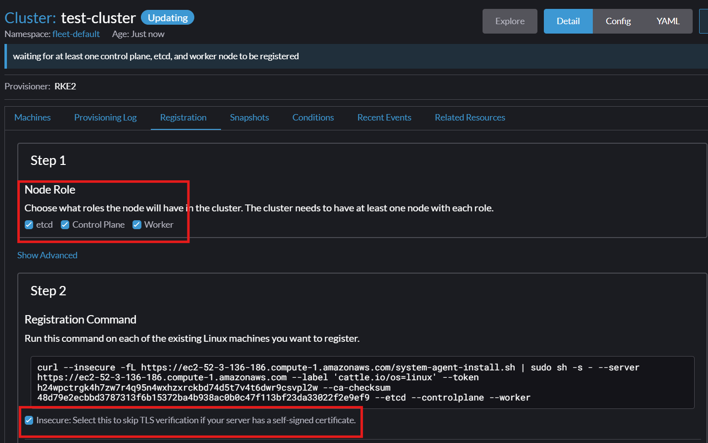

- Let that run and wait untill your cluster is ready. It will be ready when you see an active status like in ours below:


- Now, in order to use the 'kubeclt' command we installed earlier, we need to copy the KubeConfig to our machine running the cluster (second machine). To do this, click on your cluster, ours is swe645-hw2 in the previous picture. Click on the three dots in the top right and click then selected option in the picture below:


- Now past it in the following location. You with need to make the hidden directory '.kube'

```shell
    $ sudo mkdir .kube
    $ sudo vi .kube/config
```
- Paste and save in that file. Now with our cluster setup, we can deploy our application with a Deployment.

### 8.Deploy web application using Deployment:

- Back on the Racher Dashboard. Click home, then click your cluster to access your cluster dashboard like below:

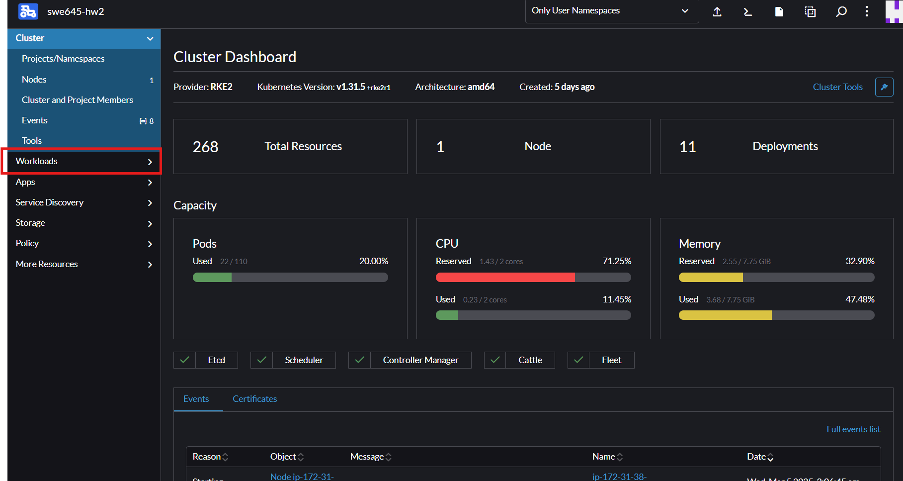

- To create a Deployment, click Workloads->Deployments and click the create button.

- Fill in custom name, set replica count to 3, paste your Docker Image tag from part 1 in Container Image box. Then scroll and click 'Add Port or Service'. Select Node Port, name it, set Private Container Port to 8080. Leave everything else default. Click create and wait for pods to deploy, it will say active like our cluster before:

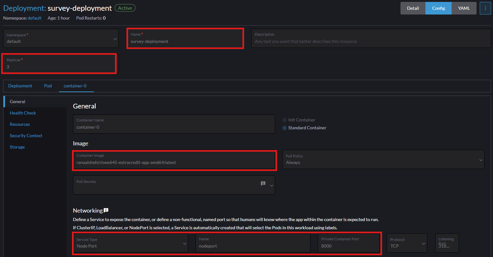

- Once you see it active state, click Service Discovery and take a look at the node port you created. Take note of the port number that was chosen randomly since we left that option blank. In out case the port number is 31221.

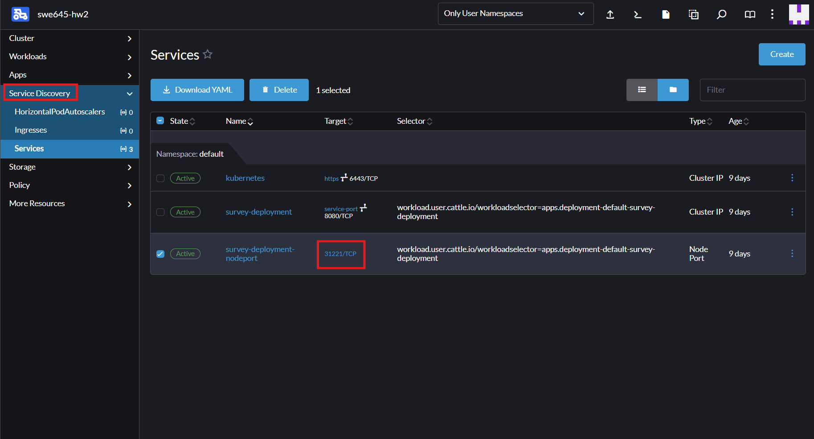

### 9. Add new security rule and access application

- In order to see our application, we need to add this port number as a new inbound rule to our security group just like we did for ports 80, 8080, 22, and 443. Go back to your AWS Dashboard on the EC2 instance page. Scroll down under Network & Security and click Security Groups.

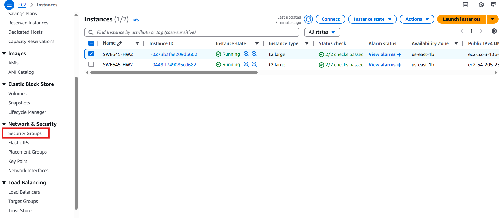

- Here select the security group that your machines are using. Unless you customized the name it is typically some form of 'launch-wizard-#'. In our case, it is launch-wizard-1. Select the group, then click Actions->Edit inbound rules.


- Now, click 'Add rule' at the bottom and set a new rule similar to the one highlighted. Make sure to use the port number from **YOUR** NodePort service. Then for source select 'Anywhere-IPv4' to add the '0.0.0.0/0' option you see in the picture below. Click save rules.


- With this rule added, we can now access our application using the NodePort service we created. Go back to your EC2 instances page. Select the **SECOND** machine, the one that has the actual cluster running on it. Get the Public IPv4 address, for us this is "54.205.232.217", and create the following URL: "http://54.205.232.217. 

- To access our application, we need to add specific parts to the end of this URL. You need to add ":"NodePort Number"/"desired endpoint"/ to get the responce from the database you wish. In our case, we add ":31221/survey/save" to save the survey data and ":31221/survey/all" to get all surveys from the database. 

**NOTE: Make sure to change form https to http or the link won't work**

- Application at [link](http://54.205.232.217:31221/<endpoint>)

- See Kris' Branch from Part 1 for the possible endpoints.
- Ex. To get all surveys, visit [link](http://54.205.232.217:31221/survey/all)

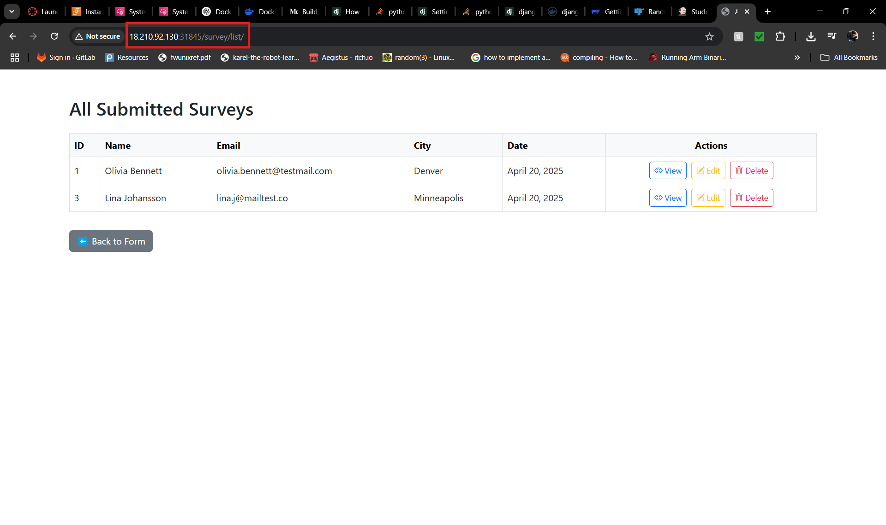

**NOTE: Links will only work in your machines are running. If you are using AWS Learner Lab. machines auto-shutoff after 4hrs.**


### Jenkins CI/CD Pipeline
### 10. Install Jenkins

With the application, machines, and cluster now setup, we can now setup our CI/CD Pipeline to automate:
- building the application jar file
- building docker image and pushing the updated image
- Updating the image on the cluster pods

To start, update system packages on both EC2 instances:
```shell
    $ sudo apt update
    $ sudo apt upgrade -y
```

Then, on the **SECOND** machine, the one running the cluster and pods, install these packages and validate java:
```shell
    $ sudo apt install fontconfig openjdk-17-jre -y
    $ java -version
```

Expected output:
```shell
    openjdk version "17.0.13" 2024-10-15
    OpenJDK Runtime Environment (build 17.0.13+11-Debian-2)
    OpenJDK 64-Bit Server VM (build 17.0.13+11-Debian-2, mixed mode, sharing)
```

Add the Jenkins Repository and Key:
```shell
    sudo wget -O /usr/share/keyrings/jenkins-keyring.asc \
    https://pkg.jenkins.io/debian-stable/jenkins.io-2023.key

    echo "deb [signed-by=/usr/share/keyrings/jenkins-keyring.asc] \
    https://pkg.jenkins.io/debian-stable binary/" | sudo tee \
    /etc/apt/sources.list.d/jenkins.list > /dev/null

    sudo apt-get update
```

Install Jenkins:
```shell
    $ sudo apt install jenkins -y
```

Start and Enable Jenkids:
```shell
    $ sudo systemctl enable jenkins
    $ sudo systemctl start jenkins
    $ sudo systemctl status jenkins
```

### 11. Access Jenkins Dashboard
Visit Jenkins Dashboard at: http://"EC2-Public-IP":8080

Get the initial admin password using the following command:
```shell
    $ sudo cat /var/lib/jenkins/secrets/initialAdminPassword
```

On the Customize Jenkins page, install suggested plugins

Then create an admin account by filling in the username, password, name, and email you want

### 12. Setup Jenkins Plugins

On the main dashboard page, go to Manage Jenkins and click Plugins

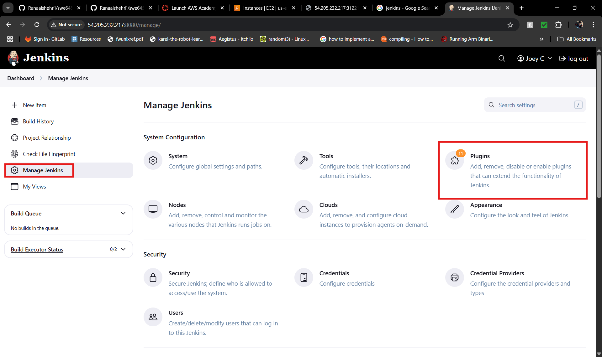

Install the following plugins if they are not already installed:
- Git plugin
- Docker Pipeline
- Kubernetes plugin

### 13. Install Docker and give Jenkins access

Now, we need to allow Jenkins to use docker for docker commands

If docker is not installed on your machine, do so with this:
```shell
    $ sudo apt update
    $ sudo apt install docker.io -y
    $ sudo apt update
    $ sudo systemctl start docker
    $ sudo systemctl enable docker
```
Then give Jenkins permission to use docker:
```shell
    $ sudo usermod -aG docker jenkins
```

Check that this worked with:
```shell
    $ groups jenkins

    output:
    jenkins: jenkins docker
```

Now, reboot this EC2 instance and then reconnect

### 14. Setup Credentials with Jenkins

Now, we need to give Jenkins all credentials needed for it to function, this includes
- **DockerHub**: To pull new image and push new images
- **GitHub**: To access source code and detect changes
- **KubeConfig**: To perform kubectl commands

Go to Manage Jenkins -> Credentials -> click (global) -> Add Credentials

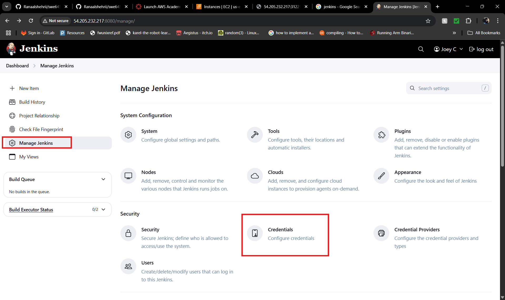

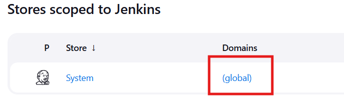

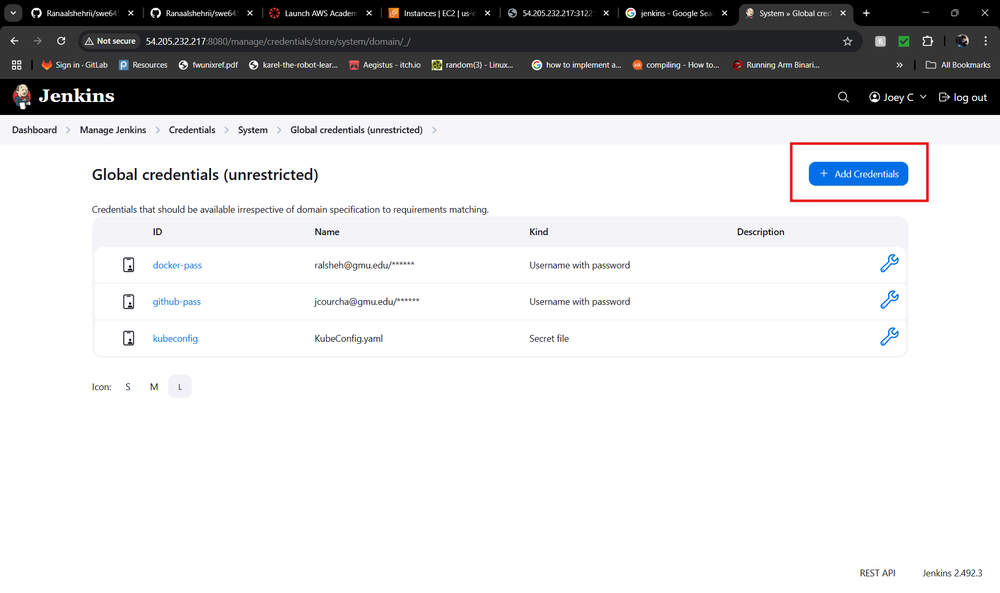


For DockerHub and GitHub Credentials:
- **Kind**: Username with password
- **Scope**: Global
- **Username**: Your username
- **Password**: Your password
- **ID**: Tag to use inside Jenkinsfile to reference this credentials information
- **Description**: Optional field to describe this credential

For KubeConfig file:

Copy your KubeConfig file over from its existing .kube folder to the one jenkins has with the following command
```shell
    $ cp /root/.kube/config /var/lib/jenkins/.kube
```

### 15. Setup Pipeline

Now, we can setup the pipeline

Back on the main dashboard page, click New Item, click Pipeline

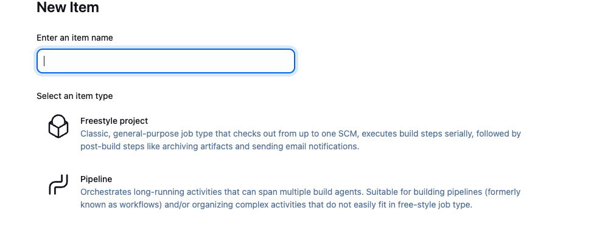

Click **GitHub Project** and paste the URL:

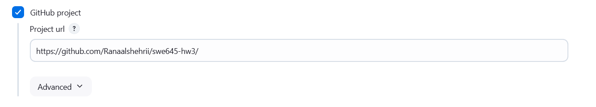


Define your pipeline like so:
- Pipeline script from SCM(Pipeline will get Jenkinsfile script from your SCM):
  - SCM: Git
  - Repo URL
  - Select GitHub Credentials added earlier
  - Branch: The branch you want Jenkins to build off of
  - Script Path: Path to Jenkkinsfile in GitHub Repo (Just 'Jenkinsfile' if in top level)

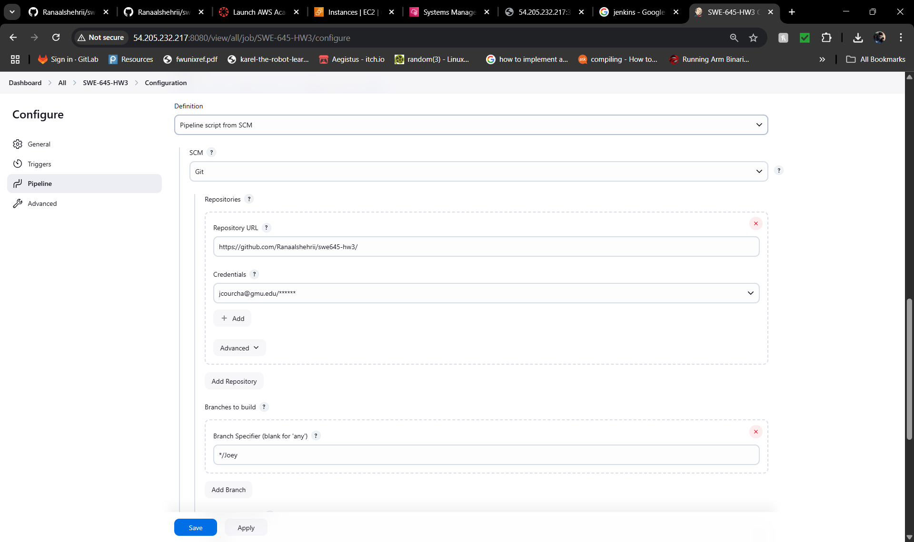

Now, go to **Triggers** section to set the pipeline to poll every minute. This means that Jenkins will check every minute for changes and schedule a build if changes are detected.

Click **Poll SCM** -> Enter "* * * * *" (5 stars with 1 space in between each)
to poll every minute

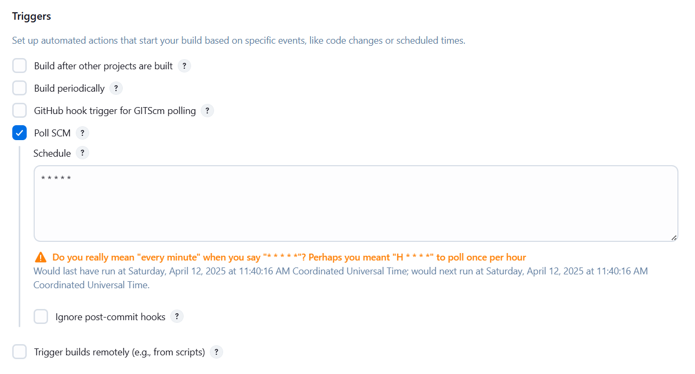

### 16. Build Pipeline

Go to main dashboard, select your pipeline, click build now. Make sure you have a Jenkinsfile like the on included in this respository.

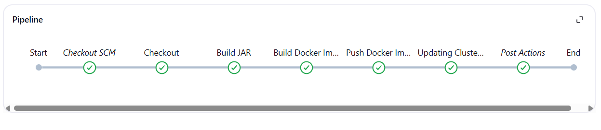


