# SWE645-Extra-Credit
## Amazon RDS MySQL Database Setup

This microservice application uses a MySQL database hosted on Amazon RDS for storing survey responses. Below are the steps used to create and configure the database:

### Step 1: Access AWS Academy Lab
- Logged into AWS Academy Lab.
- Launched the lab environment and accessed the AWS Console.

  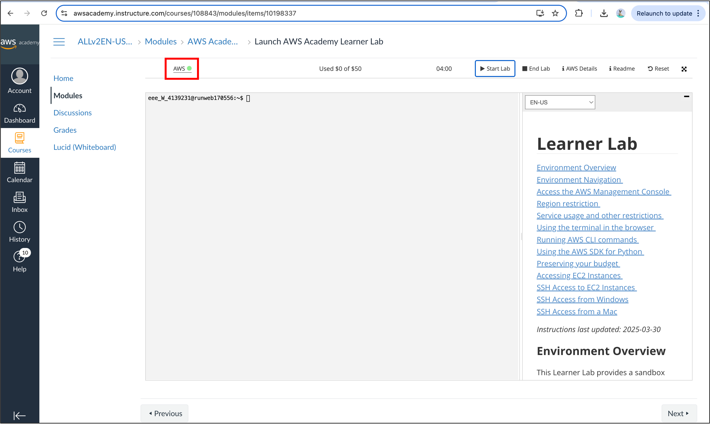

### Step 2: Navigate to Amazon RDS
- **Log in to the AWS Console** through the Learner Lab environment (usually via a **"Start Lab"** button).
- Once the lab environment is running, click **"AWS"** or **"Open AWS Console"** — this takes us to the AWS Management Console.
- In the AWS Console, use the **Search bar** at the top.
- Type `RDS` and select **Amazon RDS** from the dropdown.
- This takes us to the **Amazon RDS Dashboard**, where we can manage and create databases.
  
  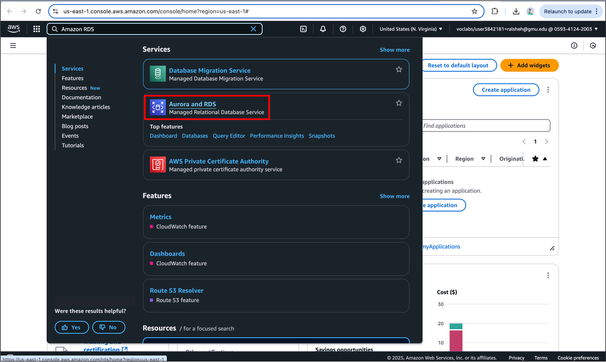
  
### Step 3: Create RDS MySQL Instance
- Navigated to **Amazon RDS** in the AWS Console.
- Clicked **"Create database"**.
- Selected:
  - Engine: **MySQL**
  - Template: **Free tier** or **Dev/Test**
  - DB instance identifier: `student-survey-db`
  - Master username: `admin`
  - Master password: `${DB_PASSWORD}`

    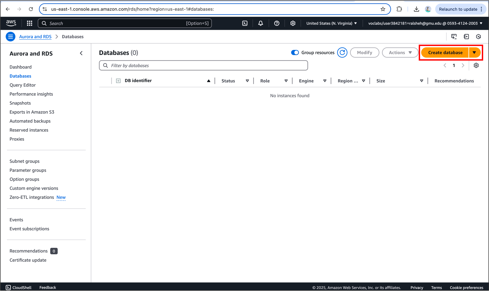

    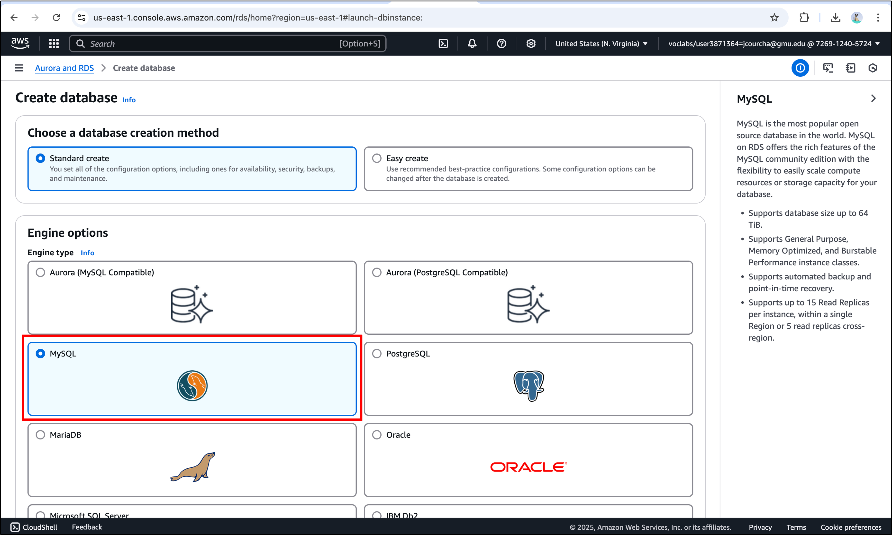
  
    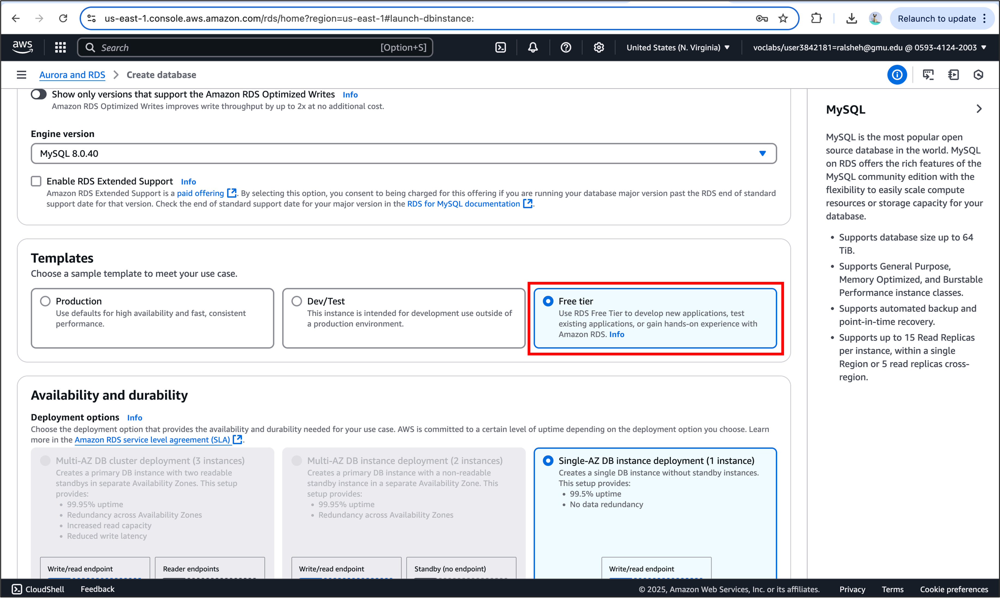

    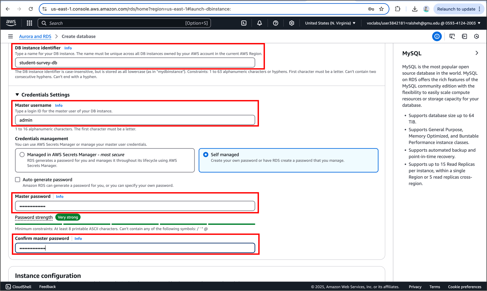
  
### Step 4: Enable Public Access
- Set **Public Access**: `Yes` during database creation.
- Used the **default VPC security group**.

  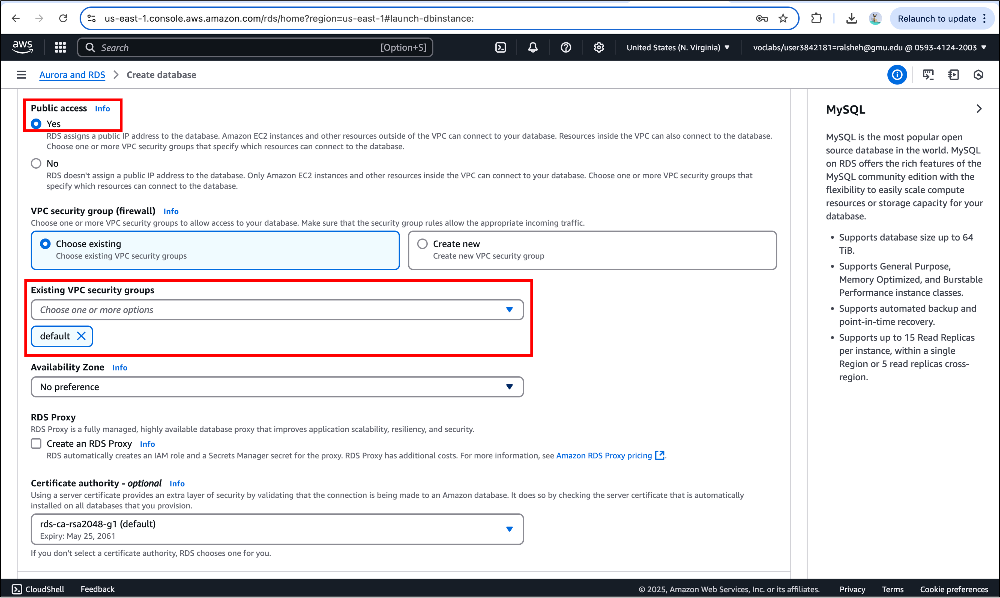

### Step 5: Configure Security Group
- Go to EC2 > Security Groups to open the Security Group settings page.

   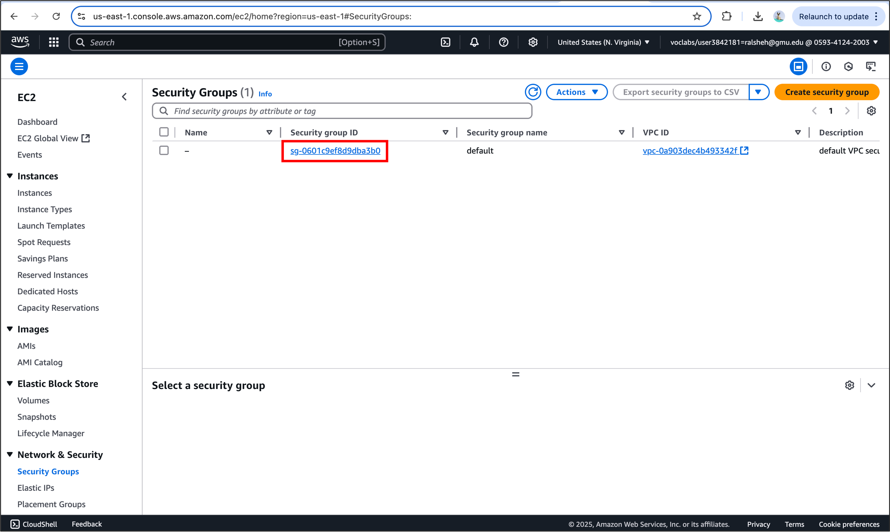
  
- Edited **Inbound Rules** of the selected security group:
  - Added rule:
    - **Type**: MySQL/Aurora
    - **Port**: 3306
    - **Source**: `0.0.0.0/0` (temporarily allowed all IPs for development)
      
      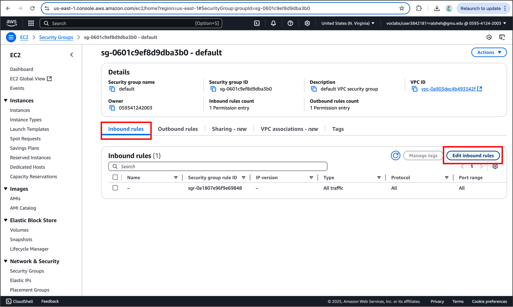

      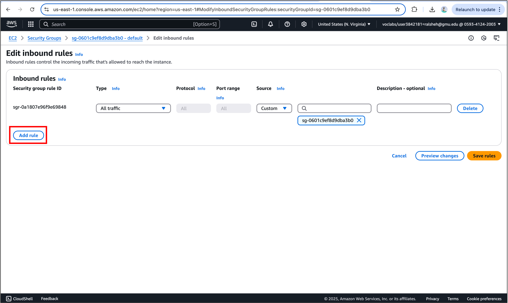

      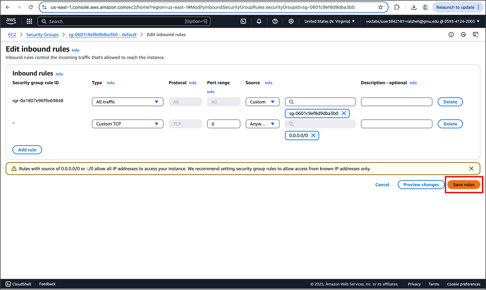

### Step 6: Get the RDS Endpoint URL
- After the database is created, go back to the **Amazon RDS dashboard**.
- Click on your DB instance name (e.g., `student-survey-db`).
- Under the **Connectivity & security** tab.
- Copy the **Endpoint** value (e.g., `student-survey-db.cpo6pmgwxit1.us-east-1.rds.amazonaws.com`).
- This endpoint will be used in our Spring Boot `application.properties`.

  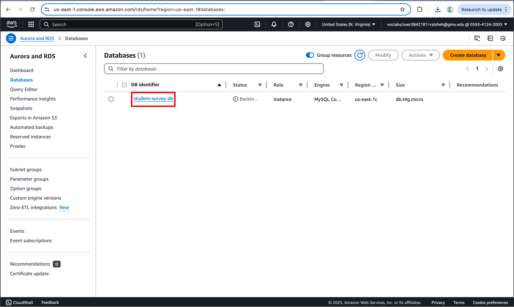

  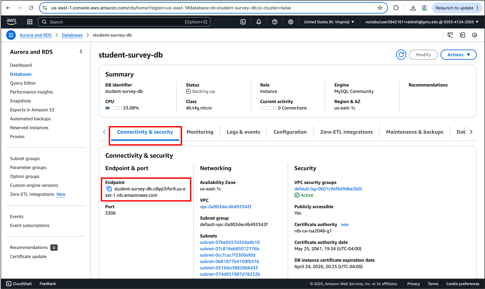
  
### Step 7: Provide Database Connection Details
- Update the Django `settings.py` file with the following MySQL RDS configuration:
  
  **MySQL RDS Database Config:**
  
  ```properties
  DATABASES = {
    'default': {
        'ENGINE': 'django.db.backends.mysql',
        'NAME': 'student-survey-db',
        'USER': 'admin',
        'PASSWORD': '01bYgdkHminrSaZg',
        'HOST': 'student-survey-db.cdlpji3ifxr9.us-east-1.rds.amazonaws.com',
        'PORT': '3306',
      }
  }

> **Note:**
> 
> - Ensure that the AWS RDS instance has **public access enabled**, and that the **security group** allows **inbound traffic on port 3306** from our IP.
> 
> - If we're using `pymysql` instead of `mysqlclient`, add the following to our app’s `__init__.py` file:
> 
> ```python
> import pymysql
> pymysql.install_as_MySQLdb()
> ```

### Result
The Django application is now connected to a cloud-based AWS RDS MySQL database, allowing centralized storage and retrieval of student survey data. This setup supports a scalable, production-ready backend that integrates seamlessly with Docker, Kubernetes, and Jenkins for full CI/CD deployment.

